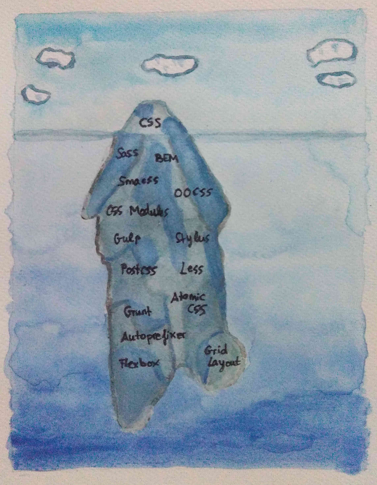

When I started with Front-end development I thought CSS would be easier, once you know the rules. But the truth is very different. You can use different tools to make it maintainable, but you have to learn them! All of this is my to-do list :)

Inspired by:

- <a href="https://twitter.com/iamdevloper/status/753716544949981184?s=03">CSS is easy by @iamdevloper</a>

- <a href="http://octuweb.com/trabajar-css-2015>Work with CSS by @@nabaroa (in Spanish)</a>
