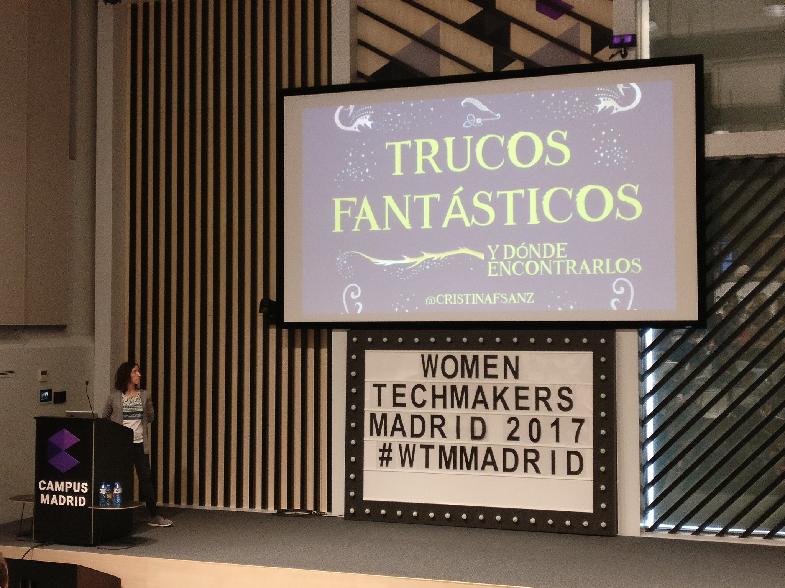
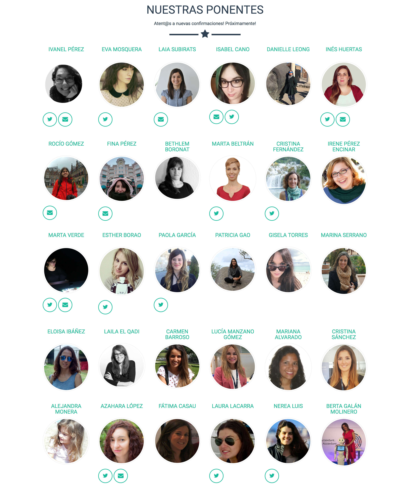

Yesterday I attended a Tech Conference, <a href="http://wtm.gdgmadrid.es/">Women Techmakers Madrid</a> and it was a wonderful event. I loved the Art and Technology talks from <a href="https://twitter.com/GreenMartinha">Marta Verde</a> and <a href="https://twitter.com/EstherBorao">Esther Borao</a> and I am now an absolute fan of <a href="https://twitter.com/LauraLacarra">Laura Lacarra</a>, her talk about <a href="http://wtm.gdgmadrid.es/agenda/laura-lacarra-confort.html">confort zone</a> should be seen by any women in tech. Moreover, the talk was so funny!

I also loved the <a href="http://wtm.gdgmadrid.es/agenda/rocio-fina-programadoraweb.html">Adalab experience</a> talk, it is very difficult to change careers and this program is a good way to help women to come to the Tech world. They have a mentoring program to help those women in the process, so I hope they can find a lot of women to help them. I want to be one of those :)

All the talks were recorded by <a href="https://www.youtube.com/user/AutentiaMedia">Autentia</a>, so I will watch all of them as soon as they are online and you should too. 

I did the <a href="https://docs.google.com/presentation/d/1P6h7f-LoZFA4r7hCydScep8u39k80x85hLt5I4tNI_0/edit#slide=id.g35f391192_00">Fantastic tricks and where to find them</a> talk again, I wanted to do it there, I love the initiative and I wanted to be part of it.

These are some moments from yesterday:

<a href="https://twitter.com/i/videos/840595421357576192">Small video of my talk (in Spanish)</a>

Speakers and organizing committee:

Waiting to start my talk:

And these are all the Women Speakers in the conference:

